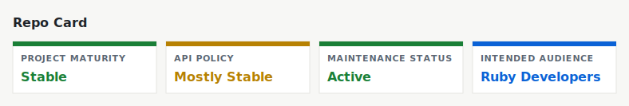

# Respec - RSpec Convenience Wrapper



Respec is a bash script convenience interface for Ruby's RSpec.

## Install

### Installing using the setup script

This setup script will download the respec executable to `/usr/local/bin/` and
install an autocomplete script in the bash completions directory.

```shell
$ curl -Ls get.dannyb.co/respec/setup | bash
```

Feel free to inspect the [setup script](setup) before running.


### Installing manually

Download the [respec](respec) script to `/usr/local/bin/` or anywhere in your
`PATH`, and make it executable.


## Usage

```
Usage:
  respec [COMMAND]
  respec [COMMAND] --help | -h
  respec --version | -v

Commands:
  all           Run all specs (default)
  focus         Run specs tagged with :focus
  only          Run specs only on files matching a pattern
  except        Run specs except files matching a pattern
  tagged        Run specs that include/exclude certain tags
  last          Run specs on files modified in the last N minutes
  fails         Run the last failed specs
  continue      Continue from where the last run stopped
  refactor      Shortcut for 'respec last 2 --watch'
  reset         Delete the status file
  completions   Echo completions function
```

## Setup 

Update the following files in your repository.

### Status file setup

This is required for the `respec continue`, `respec fails` commands.


```ruby
# spec/spec_helper.rb
RSpec.configure do |config|
  config.example_status_persistence_file_path = 'spec/status.txt'
end
```

and then, you should probably gitignore this file.

```bash
# .gitignore
/spec/status.txt
```

### Recommended rspec arguments

Put this in the `.rspec` file in your repository.


```bash
# .rspec
--require spec_helper
--color
--format documentation
--fail-fast
```

## Uninstalling

```shell
$ curl -Ls get.dannyb.co/respec/uninstall | bash
```

## Contributing / Support

If you experience any issue, have a question or a suggestion, or if you wish
to contribute, feel free to [open an issue][issues].

[issues]: https://github.com/DannyBen/respec/issues